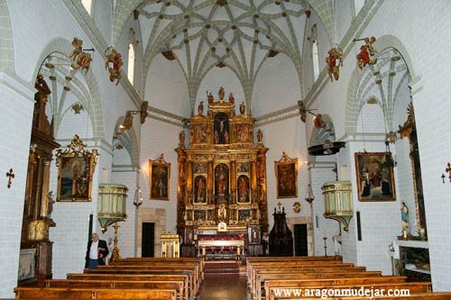
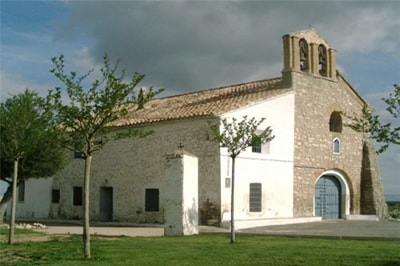
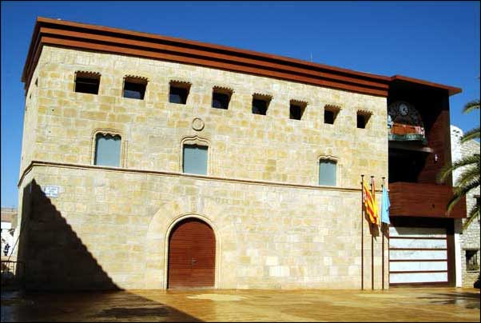

### Iglesia de San Clemente.

Templo gótico del siglo XVI, en el que destaca su esbelta torre mudéjar. Se trata de un edificio de mampostería, con sillares de piedra en los arcos y en los contrafuertes.
Destaca el retablo mayor, dedicado a San Clemente, papa y mártir, que se encargó al escultor Pedro Martinez de Calatayud, nada más terminada la iglesia, en 1573.

### Ermita de San Antonio

Templo de planta rectangular, edificado en el año 1701. Forma conjunto con la casa del ermitaño, anexa en su lado izquierdo.

### Palacio y casa de los Torres

Edificio gótico de tres plantas, sedes del actual Ayuntamiento y la Casa de Cultura, construidos a finales del siglo XV. Ambos conservan los escudos de la familia de Torres.

Templo de planta rectangular, edificado en el año 1701. Forma conjunto con la casa del ermitaño, anexa en su lado izquierdo.

### Palacio y casa de los Torres

Edificio gótico de tres plantas, sedes del actual Ayuntamiento y la Casa de Cultura, construidos a finales del siglo XV. Ambos conservan los escudos de la familia de Torres.